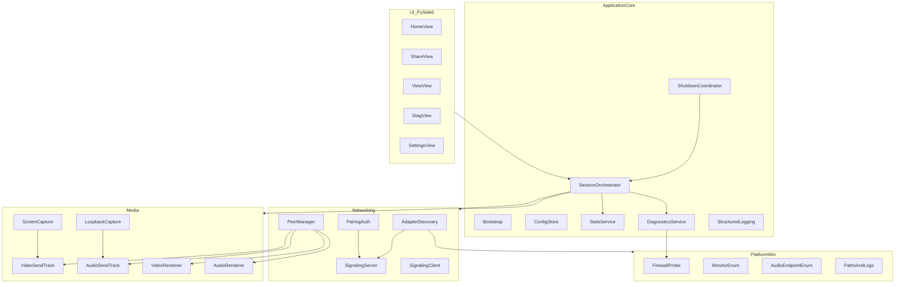
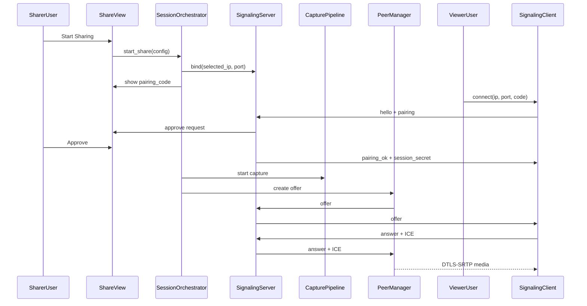
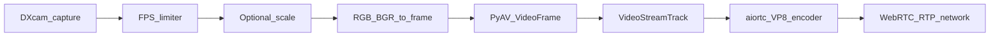
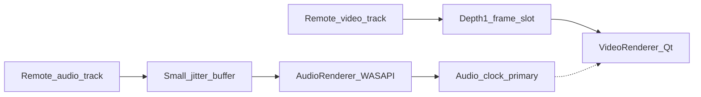
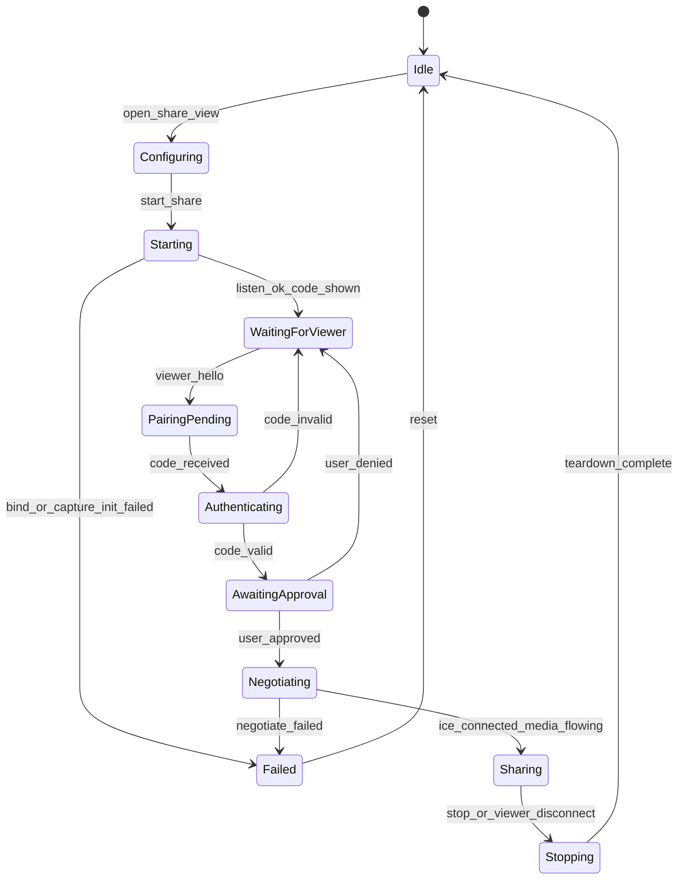
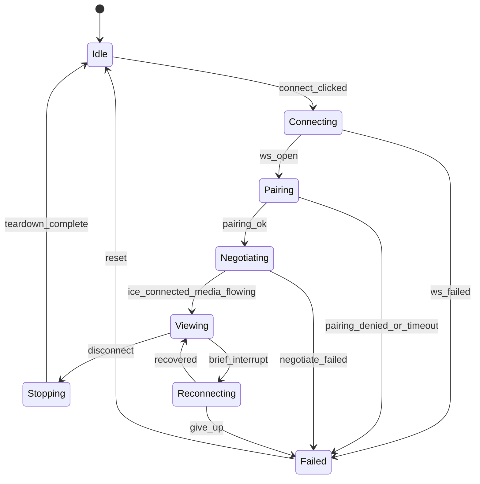
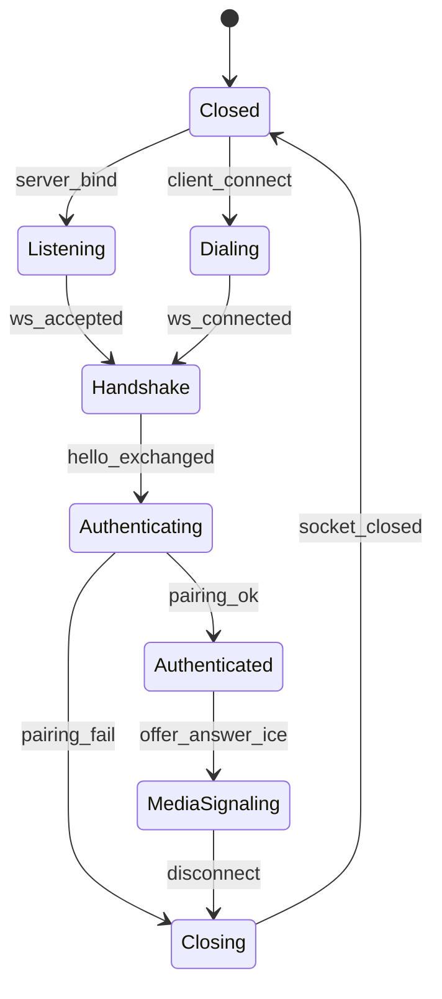
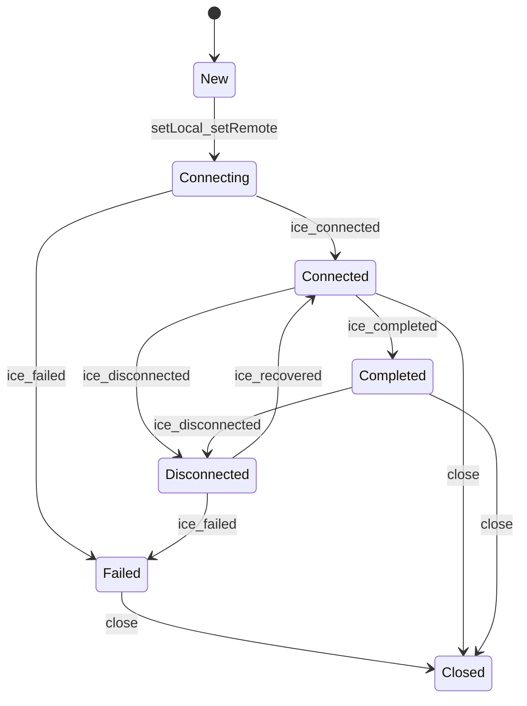
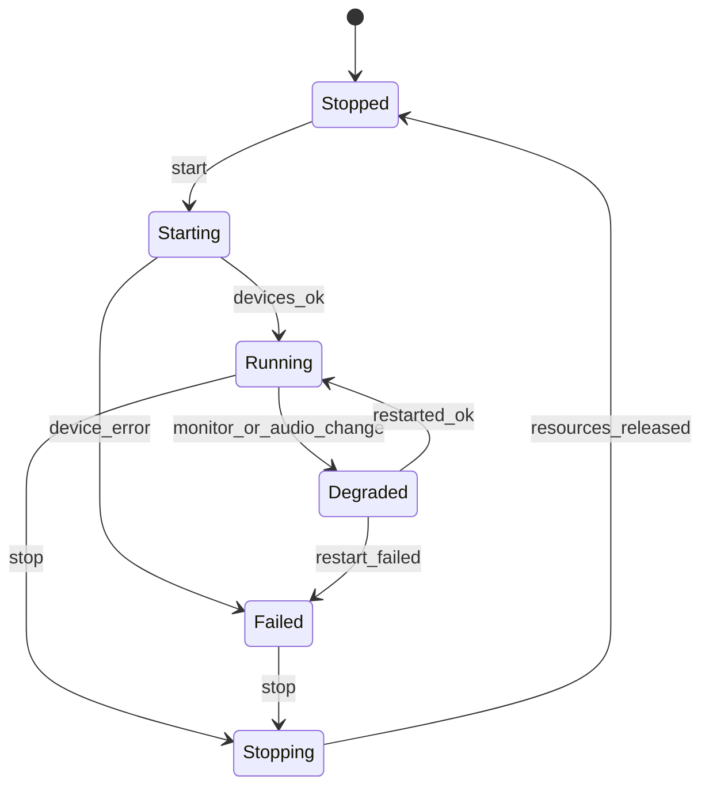

# Snowlink — Private LAN Screen & System-Audio Share

**Engineering Plan (MVP)**  
**Platform:** Windows 11 (exactly two peers on the same physical LAN)  
**Language:** Python 3.12+  
**Status:** Implementation in progress — Phases 0–3 largely complete; Phase 4 reliability + ship packaging remaining  
**Date:** 2026-08-06

---

## Table of contents

1. [Executive summary](#1-executive-summary)
2. [Scope and non-goals](#2-scope-and-non-goals)
3. [Recommended architecture](#3-recommended-architecture)
4. [Architecture diagram](#4-architecture-diagram)
5. [End-to-end media-flow diagrams](#5-end-to-end-media-flow-diagrams)
6. [Network and VPN strategy](#6-network-and-vpn-strategy)
7. [Security model](#7-security-model)
8. [Audio/video synchronization approach](#8-audiovideo-synchronization-approach)
9. [Module responsibilities](#9-module-responsibilities)
10. [Repository structure](#10-repository-structure)
11. [Signaling-message schema](#11-signaling-message-schema)
12. [State-machine diagrams](#12-state-machine-diagrams)
13. [Development phases](#13-development-phases)
14. [Test plan](#14-test-plan)
15. [Packaging plan](#15-packaging-plan)
16. [Risk register](#16-risk-register)
17. [MVP acceptance criteria](#17-mvp-acceptance-criteria)
18. [Future improvements](#18-future-improvements)
19. [Unresolved decisions](#19-unresolved-decisions)
20. [First ten implementation tasks](#20-first-ten-implementation-tasks-exact-execution-order)

Appendix: [Architecture Decision Records (ADR index)](#appendix-a-architecture-decision-records-adr-index)

---

## 1. Executive summary

Snowlink is a private, peer-to-peer Windows 11 desktop application that lets **exactly two computers on the same physical LAN** share screen video and Windows system audio in real time. Both machines run the same application. In the MVP, one machine operates in **Share** mode and the other in **View** mode. Remote mouse/keyboard control, cloud relays, TURN, accounts, and unattended access are explicitly out of scope.

### Why this design

| Concern | Approach |
|---|---|
| Media transport | **WebRTC via aiortc** (VP8 + Opus, DTLS-SRTP) — not raw UDP |
| Signaling | Sharer runs a small **WebSocket** server bound to a **selected LAN IPv4**; viewer connects by IP:port |
| VPN interference | Explicit **adapter classification**, bind-to-selected-IP, host-candidate preference, diagnostics, and documented split-tunnel / “allow LAN” guidance — never disable VPN security |
| Capture | **DXcam** (Desktop Duplication) for screen; **PyAudioWPatch** WASAPI loopback for system audio (not microphone) |
| UI | **PySide6**; all capture and networking off the UI thread |
| Security on untrusted LAN | Short-lived **6-digit pairing code**, on-sharer approval, per-session secret, one viewer, schema validation, rate limits |

### Recommendation

**Proceed with a Python 3.12 MVP** using the stack below, gated on Phase 0 experiments. The first experiment to complete is **adapter enumeration + binding a listener to a selected physical LAN IPv4 while VPNs are connected**, then two-machine TCP reachability. If Phase 0 shows glass-to-glass latency or CPU outside workable ranges at the Balanced preset, keep the architecture but schedule a native encode/capture helper earlier.

---

## 2. Scope and non-goals

### 2.1 MVP goals

1. Select the local physical network adapter.
2. Display the selected local IPv4 address.
3. Exclude VPN and virtual adapters by default.
4. Allow manual adapter and IP override.
5. Start a share session.
6. Connect from the second computer using IP address and port.
7. Show the remote screen in a resizable viewer window.
8. Play the remote computer’s Windows system audio.
9. Select a monitor when multiple monitors are connected.
10. Select an audio output endpoint for loopback capture.
11. Start and stop sharing cleanly.
12. Report connection state and actionable errors.
13. Display basic statistics (capture FPS, rendered FPS, resolution, estimated bitrate, RTT, packet loss when available, dropped video frames, audio buffer underruns).
14. Quality presets: Low `854×480@15`, Balanced `1280×720@30`, High `1920×1080@30`.
15. Mute / unmute received audio.
16. Prevent multiple unauthorized clients from connecting.

### 2.2 Non-goals (MVP)

- Remote mouse or keyboard control
- Unattended remote access
- Windows service mode
- UAC or secure-desktop capture
- Clipboard synchronization
- File transfer
- Internet relay service
- TURN server deployment
- User accounts / cloud database
- Session recording
- Bidirectional share (both share and view simultaneously) — Phase 5
- Disabling or bypassing VPN kill switches or firewall policies

### 2.3 Product positioning

Snowlink is a **screen-and-system-audio viewer** for private, authorized use between the owner’s own computers — not a commercial AnyDesk replacement.

---

## 3. Recommended architecture

### 3.1 Technical stack

| Layer | Choice | Notes |
|---|---|---|
| Runtime | Python 3.12 (or newer compatible stable) | Pin in `pyproject.toml` |
| Media transport | aiortc | WebRTC; VP8 + Opus |
| Concurrency | asyncio | Owns signaling + WebRTC |
| Screen capture | DXcam (DXGI backend default) | Desktop Duplication API |
| System audio | PyAudioWPatch (WASAPI loopback) | No microphone in MVP |
| Frame conversion | PyAV | VideoFrame / AudioFrame |
| Desktop UI | PySide6 | Viewer + share controls |
| Signaling | aiohttp WebSocket server on sharer | TCP only for SDP/ICE/pairing |
| Validation | pydantic v2 | Versioned message schemas |
| Tests | pytest (+ pytest-asyncio) | Unit + protocol + integration |
| Packaging | PyInstaller | Portable onedir first |

### 3.2 Concurrency model

```
┌─────────────────────────────┐
│  Qt main thread (PySide6)   │  UI only; no capture / no sockets
└──────────────┬──────────────┘
               │ Qt signals / slots
┌──────────────▼──────────────┐
│  asyncio event loop thread  │  signaling, aiortc, peer FSMs
└──────────────┬──────────────┘
               │ depth-1 / ring buffers (thread-safe)
┌──────────────▼──────────────┐
│  Capture worker threads     │  DXcam grab; WASAPI callback/read
└─────────────────────────────┘
```

**Selected Qt↔asyncio bridge:** dedicated **asyncio thread** with thread-safe marshaling into Qt (`QMetaObject.invokeMethod` / signals). `qasync` remains a fallback if the dedicated-thread approach proves awkward for track lifecycle.

**Rationale:** Keeps the UI responsive under encode load; avoids nesting Qt’s event loop inside asyncio in the MVP.

### 3.3 Latency-first buffer policy

- Video: **latest-frame / queue depth 1**. Always prefer dropping an old frame over growing latency.
- Audio: **small bounded ring buffer** (e.g. 100–200 ms capacity). Detect underrun/overrun; never unbounded growth.
- Receiver video: drop stale decoded frames before paint.
- Receiver audio: continuous playback with a small jitter buffer (~40–80 ms).

### 3.4 Dependency injection

Use constructor injection of narrow protocols (`AdapterEnumerator`, `ScreenCapturer`, `Clock`, `FirewallProbe`) for testability. No enterprise IoC container.

### 3.5 Platform realism (Python performance)

Python is appropriate for orchestration, signaling, UI, and an MVP media path. Expect:

- Software VP8 encode at 1080p30 to be **CPU-heavy**.
- Extra RGB↔YUV copies via PyAV to cost measurable latency.
- The GIL to limit parallel CPU work in one process.

**Components that may later need a native C++/C#/Rust helper** (keep Python for MVP first):

| Component | Why native later |
|---|---|
| Capture + scale + color convert | Zero-copy DXGI / GPU path |
| Hardware encode (NVENC/QSV/AMF) | CPU budget at High preset |
| WASAPI exclusive / lower-latency loopback | Tighter audio timing |
| Cursor overlay / WGC features | Windows.Graphics.Capture APIs |

---

## 4. Architecture diagram



### 4.1 Share-mode runtime topology



---

## 5. End-to-end media-flow diagrams

### 5.1 Video sender pipeline



**Requirements mapped:**

| Requirement | Mechanism |
|---|---|
| No unbounded queue | Depth-1 latest-frame slot between capture and track |
| Drop old over latency | Overwrite pending frame; increment `dropped_capture_frames` |
| Monotonic timestamps | Session epoch via `time.perf_counter_ns` → PTS |
| Resolution change | Detect size change; renegotiate or restart track |
| Monitor disconnect | Capture error → stop share with actionable message |
| Reliable stop | `ShutdownCoordinator` stops camera, joins threads, closes track |
| Minimize copies | Prefer contiguous numpy views; defer GPU path to Phase 5 |

### 5.2 Audio sender pipeline


**Requirements mapped:**

| Requirement | Mechanism |
|---|---|
| 48 kHz target | Resample when endpoint ≠ 48 kHz |
| Real-time Opus framing | 20 ms frames (960 samples @ 48 kHz) |
| Continuous timestamps | PTS advances even during silence |
| Bounded ring | Fixed capacity; overrun drops oldest or newest per policy (prefer drop oldest for live) |
| Underrun/overrun detect | Counters exposed to StatsService |
| Endpoint changes | Subscribe to default-device change; restart loopback |
| Silence | Emit silence frames; do not stall track |
| No microphone | Enumerate output loopback analogues only |
| DRM | Document: protected content may capture as silence |

### 5.3 Receiver pipeline



| Requirement | Mechanism |
|---|---|
| Low render latency | Depth-1; paint latest |
| Continuous audio | Jitter buffer; underrun counter |
| Audio primary timing | Video drops/skips to stay near audio clock |
| Placeholder on pause | Show last frame dimmed or “Video paused” |
| Temporary interruption | Peer FSM → `Reconnecting` / track ended handlers; clear errors on recovery |

### 5.4 Later GPU acceleration (not MVP)


Identify this path in code boundaries (`ScreenCapturer` / `VideoEncoder` protocols) so a native helper can replace Python encode without rewriting signaling.

---

## 6. Network and VPN strategy

### 6.1 Problem statement

Both Windows 11 PCs may be on the same physical LAN **and** each connected to a different VPN. VPN virtual adapters, altered default routes, kill switches, and Windows Firewall often break naïve “bind 0.0.0.0 + use default route” designs. Snowlink must make the **physical LAN path explicit and user-visible**.

### 6.2 Adapter discovery component

**Module:** `snowlink.net.adapters`

**Responsibilities:**

1. Enumerate active IPv4 adapters (`psutil.net_if_addrs` / `net_if_stats`, supplemented with Win32 `GetAdaptersAddresses` where needed).
2. Classify each adapter:
   - **Physical:** Ethernet, Wi-Fi (IF_TYPE / description heuristics)
   - **Virtual / tunnel:** VPN clients, `TUN`/`TAP`, Wintun, WireGuard, OpenVPN, Cisco, GlobalProtect, etc.
   - **Hypervisor / container:** Hyper-V, VMware, VirtualBox, WSL
   - **Overlay mesh:** Tailscale (allowed as **optional fallback**, never default)
   - **Loopback**
3. Prefer private LAN addresses: `10.0.0.0/8`, `172.16.0.0/12`, `192.168.0.0/16`.
4. **Do not** assume the interface with the default route is correct.
5. Score candidates; auto-select best physical private IPv4; always allow full manual override.
6. Expose classification labels in UI and Diagnostics.

### 6.3 Binding and ICE policy

| Concern | Policy |
|---|---|
| Signaling listen | Bind to **selected IPv4** (not `0.0.0.0` by default) |
| Port | Default **3847/tcp** (configurable) |
| STUN/TURN | **None** in MVP (`iceServers = []`) |
| ICE | Prefer **host candidates** on the selected IP; filter or munge SDP if aioice gathers VPN hosts |
| UDP media | WebRTC host–host on LAN; document firewall allowance for the app executable |

### 6.4 VPN kill-switch / LAN access fallback (documented, not automated)

Snowlink **must not** disable or bypass VPN security settings.

Documented user fallback (`docs/vpn-lan-access.md`):

1. In the VPN client, enable **“Allow local network access”**, **“Allow LAN”**, or equivalent split-tunnel option.
2. Confirm both PCs still have distinct physical LAN IPv4 addresses on the same subnet (or routable LAN).
3. Re-run Diagnostics → Signaling handshake.
4. Optional later: use Tailscale IPs if both nodes are on the same Tailnet (Phase 5) — not mandatory.

### 6.5 Connection-diagnostics workflow

Diagnostics must verify, in order (ICMP ping is optional and **never sufficient alone**):

1. Selected IP belongs to an **active** interface.
2. Signaling **TCP port can be opened** on that IP (local bind test).
3. Server is **listening on the intended interface** (report `getsockname()`).
4. Remote peer can complete a **signaling handshake** (hello → pairing challenge path or dedicated probe message).
5. WebRTC ICE reaches **`connected` / `completed`**.
6. Audio and video packets / frames **begin arriving** (RTP counters or track frames).
7. Windows Firewall rule is **present**, or the user receives **clear setup instructions** (first-listen Windows prompt; optional `netsh` query; never silent policy bypass).

Actionable error examples:

- `BIND_FAILED`: address not local or port in use
- `FIREWALL_TIMEOUT`: TCP connect hangs; suggest firewall + VPN LAN allow
- `PAIRING_REJECTED` / `PAIRING_RATE_LIMITED`
- `ICE_FAILED`: show local/remote candidates summary (sanitized)
- `NO_MEDIA`: ICE up but no frames — capture or codec issue

### 6.6 Decision record — networking

| Field | Content |
|---|---|
| **Selected approach** | Explicit adapter pick + bind selected IP + host-candidate preference + diagnostics |
| **Alternatives** | Bind `0.0.0.0`; rely on STUN; force Tailscale; mDNS-only discovery |
| **Reason** | VPN default routes are hostile; user must see and control the LAN path |
| **Risks** | Misclassification of adapters; ICE still advertising VPN hosts |
| **Fallback** | Manual IP override; SDP host filter; Tailscale optional path; documented VPN LAN allow |

---

## 7. Security model

### 7.1 Design principles

The LAN is **not trusted**. Authentication happens on the signaling channel **before** media negotiation. Media confidentiality/integrity relies on WebRTC **DTLS-SRTP**.

### 7.2 Pairing and session secrets

| Element | Behavior |
|---|---|
| Pairing code | Cryptographically random **6-digit** code displayed on sharer |
| Session secret | Fresh high-entropy secret per share session (not the 6-digit code alone) |
| Approval | Incoming pairing shown on sharer; user Approve / Deny |
| TTL | Unused pairing expires (recommend **3 minutes**) |
| Storage | No permanent shared password in plain text; secrets only in memory (+ optional OS-protected config for UI prefs, not session secrets) |
| Comparison | `hmac.compare_digest` (constant-time) |
| Viewer limit | **Exactly one** authenticated viewer in MVP; further connections rejected |
| Replay resistance | `session_id` + single-use nonce + expiry on pairing messages |
| Rate limit | Failed pairing attempts per source IP (e.g. 5 / minute, then temporary lockout) |

### 7.3 Signaling hardening

- Max message size (e.g. **256 KiB**; SDP-safe upper bound, reject larger)
- Read/idle timeouts
- Malformed JSON → close with error; no crash
- Explicit signaling state transitions (see §12)
- Schema validation (pydantic) on every message
- Protocol version negotiation in `hello`

### 7.4 Application hardening

- No remote execution, shell-command, or eval endpoints
- Strict input validation on all UI and network inputs
- Safe logging: never log pairing codes, session secrets, or full SDPs (log hashes/lengths/types only)
- Visible **sharing indicator** whenever screen or audio is shared
- Local confirmation dialog before capture starts
- Automatic shutdown of sharing and sockets on application exit (`ShutdownCoordinator`)

### 7.5 Remaining threat model and limitations

| Threat | Mitigation | Residual risk |
|---|---|---|
| Unauthorized LAN client | Pairing + approve + one viewer | Attacker with code + physical/UI access during approve window |
| Brute-force 6-digit code | TTL + rate limit + approve | Local attacker with many IPs / compromised rate limiter |
| MitM on signaling before auth | Short window; user verifies code out-of-band | Pure LAN MitM before pairing completes |
| Malware on either host | Out of scope | Full compromise |
| Malicious SDP/ICE | Schema + size limits + aiortc parsing | Parser bugs upstream |
| DRM / protected audio | Document silence | User confusion |
| VPN kill-switch | Diagnostics + docs | Connection impossible until user changes VPN settings |
| Steal session mid-stream | DTLS-SRTP; one viewer | Endpoint malware |

---

## 8. Audio/video synchronization approach

### 8.1 Selected approach

**Audio is the primary timing reference** on the receiver. Video is allowed to skip/drop frames to stay near the audio clock. Sender assigns continuous monotonic PTS to both tracks from a shared **session epoch** (`perf_counter_ns` at share start).

### 8.2 Sender clocks

- Video PTS: based on capture time relative to session epoch (not wall clock).
- Audio PTS: based on cumulative PCM samples produced / resampled (preferred) or capture callback time — **sample-driven PTS** is preferred to avoid drift from sleep jitter.
- Do not use `datetime.utcnow()` for media timing.

### 8.3 Receiver policy

1. Maintain audio jitter buffer target (e.g. 60 ms).
2. Track `audio_playhead_pts`.
3. When painting video, if frame PTS is behind playhead by more than threshold → drop; if ahead → hold briefly (cap hold to avoid backlog).
4. On long gap: show placeholder; resume on next fresh frame without attempting to “catch up” a multi-second backlog.

### 8.4 Drift control

| Mechanism | Purpose |
|---|---|
| Sample-accurate audio PTS | Prevent gradual audio timeline skew |
| Depth-1 video | Prevent video latency accumulation |
| Stats: `av_skew_ms` | Observe drift over long sessions |
| Periodic video resync drop | If skew > threshold (e.g. 80–100 ms) |

### 8.5 Decision record — A/V sync

| Field | Content |
|---|---|
| **Selected approach** | Audio-primary + shared session epoch + drop-stale video |
| **Alternatives** | Independent clocks; A/V interleaved container; video-primary |
| **Reason** | System audio continuity matters; video can drop frames |
| **Risks** | Capture device clocks diverge; resample drift |
| **Fallback** | Hard resync drops; restart audio track on severe underrun |

---

## 9. Module responsibilities

| Module | Responsibility |
|---|---|
| `app` / bootstrap | Process entry, create Qt app, start asyncio thread, wire DI |
| `config` | Load/save user prefs (adapter id, port, preset, window geometry) under `%LOCALAPPDATA%\Snowlink\` |
| `ui` | Home / Share / View / Settings / Diagnostics views; sharing indicator |
| `net.adapters` | Enumerate, classify, score, select adapters/IPs |
| `net.signaling_server` | aiohttp WS server bound to selected IP; session FSM |
| `net.signaling_client` | Viewer WS client; timeouts; reconnect policy (Phase 4) |
| `security.pairing` | Code generation, approve flow, rate limit, constant-time compare |
| `rtc.peer_manager` | aiortc `RTCPeerConnection`, tracks, ICE/state hooks |
| `media.screen_capture` | DXcam wrapper; monitor select; FPS limit; latest-frame slot |
| `media.loopback_capture` | PyAudioWPatch WASAPI loopback; ring buffer; endpoint select |
| `media.video_track` | Custom `VideoStreamTrack` |
| `media.audio_track` | Custom `AudioStreamTrack` |
| `media.video_renderer` | Qt paint path; scale-to-fit; fullscreen |
| `media.audio_renderer` | Playback device; mute; underrun stats |
| `stats` | Aggregate capture/render FPS, bitrate estimate, RTT, loss, drops |
| `diagnostics` | Ordered connectivity checklist; sanitized log tail |
| `logging_setup` | Structured logging; secret redaction filter |
| `shutdown` | Ordered teardown: stop capture → close PC → stop server → flush logs |
| `platform_win` | Firewall probe, monitor/audio enumeration helpers, paths |
| `tests` | Unit, protocol, integration, fixtures/mocks |

---

## 10. Repository structure

```
snowlink/
├── PLAN.md                          # This document
├── README.md                        # Quick start (added when coding begins)
├── LICENSE
├── pyproject.toml                   # Project metadata, Python >=3.12, entry points
├── requirements.txt                 # Pinned runtime deps
├── requirements-dev.txt             # pytest, ruff, mypy, PyInstaller, etc.
├── logging.yaml                     # Default logging config
├── config/
│   └── default.toml                 # Default port, presets, timeouts
├── src/
│   └── snowlink/
│       ├── __init__.py
│       ├── __main__.py              # python -m snowlink
│       ├── app.py                   # Bootstrap
│       ├── config.py
│       ├── constants.py             # Protocol version, default port 3847, limits
│       ├── logging_setup.py
│       ├── shutdown.py
│       ├── ui/
│       │   ├── main_window.py
│       │   ├── home_view.py
│       │   ├── share_view.py
│       │   ├── view_view.py
│       │   ├── diagnostics_view.py
│       │   ├── settings_view.py
│       │   └── widgets/             # Stats panel, sharing indicator, etc.
│       ├── net/
│       │   ├── adapters.py
│       │   ├── signaling_server.py
│       │   ├── signaling_client.py
│       │   ├── messages.py          # pydantic schemas
│       │   └── protocol.py          # state transitions for signaling
│       ├── security/
│       │   ├── pairing.py
│       │   └── secrets.py
│       ├── rtc/
│       │   ├── peer_manager.py
│       │   ├── ice_policy.py        # host filter / selected IP preference
│       │   └── stats_bridge.py
│       ├── media/
│       │   ├── screen_capture.py
│       │   ├── loopback_capture.py
│       │   ├── video_track.py
│       │   ├── audio_track.py
│       │   ├── video_renderer.py
│       │   ├── audio_renderer.py
│       │   └── quality.py           # presets
│       ├── stats/
│       │   └── service.py
│       ├── diagnostics/
│       │   └── workflow.py
│       └── platform_win/
│           ├── firewall.py
│           ├── monitors.py
│           ├── audio_endpoints.py
│           └── paths.py
├── tests/
│   ├── unit/
│   ├── integration/
│   ├── protocol/
│   └── fixtures/                    # mock frames, fake adapters
├── experiments/                     # Phase 0 scripts (A–F)
│   └── README.md
├── scripts/
│   ├── dev/                         # run app, format, typecheck
│   ├── package/                     # PyInstaller helpers
│   └── firewall/                    # documented netsh examples (manual)
├── docs/
│   ├── adr/                         # Architecture Decision Records
│   ├── runbooks/
│   └── vpn-lan-access.md
├── packaging/
│   ├── snowlink.spec
│   └── installer-notes.md
└── adrs/                            # Optional mirror of docs/adr for discoverability
```

### Purpose of major directories

| Path | Purpose |
|---|---|
| `src/snowlink` | Installable application package |
| `tests` | Automated verification |
| `experiments` | Disposable Phase 0 validation scripts |
| `scripts` | Developer and packaging utilities |
| `docs` | Human docs, VPN runbook, ADRs |
| `packaging` | PyInstaller / installer artifacts |
| `config` | Default non-secret configuration |

---

## 11. Signaling-message schema

### 11.1 Selected design

**The sharing computer runs the WebSocket signaling server. The viewing computer connects to `ws://<selected-ip>:<port>`.**

| Field | Content |
|---|---|
| **Selected approach** | Sharer-as-server WebSocket |
| **Alternatives** | HTTP POST offer/answer; mutual listen; mDNS service browser first |
| **Reason** | Matches “enter IP + port”; single inbound firewall hole; clear roles |
| **Risks** | Inbound TCP blocked by firewall/VPN |
| **Fallback** | Diagnostics + firewall docs; later Tailscale addressing |

Trickle ICE is supported. Non-trickle (bundled candidates in SDP) is allowed as a compatibility fallback.

### 11.2 Envelope

All messages are JSON objects:

```json
{
  "v": 1,
  "session_id": "01J...",
  "msg_id": "01J...",
  "ts": 1735689600123,
  "type": "hello",
  "payload": {}
}
```

| Field | Type | Rules |
|---|---|---|
| `v` | int | Protocol version; MVP = `1` |
| `session_id` | string | Stable for the share session; ULID/UUID |
| `msg_id` | string | Unique per message |
| `ts` | int | Unix ms; used with expiry windows |
| `type` | string | Enum below |
| `payload` | object | Type-specific; validated |

**Limits:** max serialized size 256 KiB; unknown fields rejected or ignored per pydantic `extra='forbid'`.

### 11.3 Message types

| `type` | Direction | Purpose |
|---|---|---|
| `hello` | C→S | Protocol version, client role `viewer`, capabilities |
| `hello_ack` | S→C | Server version, session_id, requires_pairing |
| `pairing_challenge` | S→C | Nonce, expiry (after viewer presents code intent) |
| `pairing_response` | C→S | Pairing code proof, nonce echo, client ephemeral |
| `pairing_result` | S→C | `ok` / `denied` / `expired` / `rate_limited`; session secret material if ok |
| `offer` | S→C | WebRTC SDP offer (after auth) |
| `answer` | C→S | WebRTC SDP answer |
| `ice_candidate` | both | Trickle ICE candidate or end-of-candidates |
| `state` | both | Connection/share state for UI sync |
| `error` | both | Machine-readable `code` + safe `message` |
| `disconnect` | both | Graceful teardown reason |
| `ping` / `pong` | both | Liveness (optional) |

### 11.4 Example payloads (illustrative)

**`pairing_response`**

```json
{
  "code": "483920",
  "nonce": "...",
  "client_proof": "..."
}
```

**`offer` / `answer`**

```json
{
  "sdp": "<SDP string>",
  "sdp_type": "offer"
}
```

**`ice_candidate`**

```json
{
  "candidate": "...",
  "sdpMid": "0",
  "sdpMLineIndex": 0,
  "completed": false
}
```

**`error`**

```json
{
  "code": "VIEWER_SLOT_TAKEN",
  "message": "A viewer is already connected."
}
```

### 11.5 Auth gate

No `offer` / `answer` / `ice_candidate` is accepted until signaling state is `Authenticated`. Unauthorized messages → `error` + close.

---

## 12. State-machine diagrams

### 12.1 Share session



### 12.2 View session



### 12.3 Signaling connection



### 12.4 Peer connection



### 12.5 Capture lifecycle



Illegal transitions raise and are logged; UI binds to enum states only.

---

## 13. Development phases

### Phase 0 — Technical validation

**Objective:** Prove each risky dependency works in isolation on Windows 11 with VPNs enabled.

**Implementation tasks:**

- Experiment A: adapter enumeration, classification, bind-to-selected-IP TCP echo
- Experiment B: two-machine TCP while both VPNs connected; record failures
- Experiment C: DXcam → local preview + FPS/latency counters
- Experiment D: WASAPI loopback → local playback + underrun metrics
- Experiment E: aiortc synthetic video track (loopback / two-process)
- Experiment F: aiortc synthetic audio + Opus playback

**Dependencies:** Python 3.12 venv; DXcam; PyAudioWPatch; aiortc; PyAV; PySide6 (for C preview optional).

**Major risks:** VPN blocks LAN; DXcam permission/FPS; loopback device discovery; aiortc ICE host selection.

**Test strategy:** Manual scripts with printed pass/fail; capture metrics JSON.

**Completion criteria:** A–F documented results on both target PCs; VPN failure modes written to `docs/vpn-lan-access.md`.

**Demonstrable result:** Scripts prove bind path + capture + synthetic WebRTC A/V.

---

### Phase 1 — Screen-only prototype

**Objective:** One-way screen stream over WebRTC with manual IP connection.

**Tasks:** Signaling server/client minimal; PeerManager; DXcam VideoStreamTrack; simple viewer window; connection state; controlled shutdown.

**Dependencies:** Phase 0 A, B, C, E go.

**Risks:** End-to-end latency; ICE wrong interface; unbounded queues.

**Tests:** Two-machine video; disconnect/shutdown resource checks; basic unit tests for adapter scoring.

**Completion criteria:** Viewer sees remote screen; stop cleans up; no audio yet.

**Demo:** Share desktop on PC-A; view on PC-B via IP:port.

---

### Phase 2 — System audio

**Objective:** WASAPI loopback → Opus → playback with sync/buffer metrics.

**Tasks:** LoopbackCapture; AudioStreamTrack; AudioRenderer; mute; underrun stats; A/V skew metric.

**Dependencies:** Phase 1; Phase 0 D, F.

**Risks:** Drift; endpoint hotplug; DRM silence confusion.

**Tests:** Hear system audio; mute; underrun injection; short soak.

**Completion criteria:** Audio + video together; metrics visible in console/UI stub.

**Demo:** Play music on sharer; hear on viewer with picture.

---

### Phase 3 — Desktop MVP

**Objective:** Full PySide6 UX meeting MVP feature list.

**Tasks:** All views; pairing + approval; adapter/monitor/audio selectors; quality presets; diagnostics workflow; error strings; sharing indicator; stats panel.

**Dependencies:** Phase 2.

**Risks:** UI thread blocking; pairing UX clarity; firewall messaging.

**Tests:** Protocol malformed/unauthorized tests; UI smoke; two-machine MVP checklist.

**Completion criteria:** All §2.1 items satisfied on wired LAN; VPN case documented.

**Demo:** End-to-end Share/View with pairing and diagnostics.

---

### Phase 4 — Reliability

**Objective:** Survive real-world churn and produce a portable build.

**Tasks:** Reconnection policy; resolution change; audio-device change; VPN route change detection; packet-loss simulation; 30m/2h/8h soaks; PyInstaller onedir; CPU/memory monitoring.

**Dependencies:** Phase 3.

**Risks:** Leak on reconnect; PyInstaller missing DLLs; ICE after VPN change.

**Tests:** Soak suites; fault injection; clean Win11 VM smoke.

**Completion criteria:** 8h soak without crash/unbounded growth; portable debug build runs.

**Demo:** Packaged app on both PCs; intentional disconnect recovery.

---

### Phase 5 — Optional improvements

**Objective:** Post-MVP enhancements.

**Tasks (backlog):** Bidirectional sharing; HW video encoding; Windows.Graphics.Capture native helper; adaptive bitrate; local discovery; Tailscale addressing; TURN for non-LAN; signed installer; auto-updates.

**Dependencies:** Stable Phase 4.

**Risks:** Scope creep; signing cert ops; TURN operational cost.

**Tests:** Per-feature; security review for any new network surface.

**Completion criteria:** Feature-specific (not required for MVP ship).

**Demo:** Per selected feature.

---

## 14. Test plan

### 14.1 Automated

| Category | Examples |
|---|---|
| Unit | Adapter classification; scoring; pairing compare; ring buffer; preset scaling math; FSM transitions |
| Protocol | Valid message round-trip; version mismatch; oversized message; malformed JSON; extra fields |
| Unauthorized | Second viewer rejected; wrong code; expired code; rate limit |
| Integration | Local two-process signaling + synthetic tracks (CI-friendly without real capture) |
| Mocks | Fake `ScreenCapturer` frames; fake PCM generator; fake adapter list |

### 14.2 Manual / two-machine

| Scenario | Focus |
|---|---|
| Wired LAN baseline | Latency, FPS, audio |
| Both VPNs on | Adapter selection, bind, handshake |
| Windows Firewall default | First-run prompt / instructions |
| Multi-monitor | Monitor switch mid-session (Phase 4) |
| Audio endpoint switch | Restart capture (Phase 4) |
| Disconnect / reconnect | Clean teardown; Phase 4 recovery |
| Packet loss / latency | Clumsy or similar; observe drops vs backlog |
| Soak 30m / 2h / 8h | Stability, memory, drift |
| Shutdown leak | Handle/thread/socket counts before/after |

### 14.3 Performance / sync measurement

- Glass-to-glass: visual marker + high-speed phone timer or LED flash method
- Audio latency: click/beep alignment test
- `av_skew_ms` logged periodically
- Process CPU/memory via Performance Monitor or `psutil`

---

## 15. Packaging plan

1. Create venv with Python 3.12+.
2. Pin runtime in `requirements.txt`; dev tools in `requirements-dev.txt` (or lock via `uv`/`pip-tools`).
3. Develop as `pip install -e .`.
4. PyInstaller **onedir** portable debug build first (`packaging/snowlink.spec`).
5. Bundle PyAV/FFmpeg native libs; verify on clean Windows 11 VM.
6. Detect missing VC++ runtime and show actionable dialog.
7. On first listen, allow Windows Firewall prompt for the executable; document manual rule if blocked.
8. Prefer **no Administrator** for normal execution; never require admin to “defeat” VPN.
9. Later: signed installer (Phase 5); keep portable build for debugging.
10. Config: `%LOCALAPPDATA%\Snowlink\config.toml`
11. Logs: `%LOCALAPPDATA%\Snowlink\logs\` with rotation; redaction filter enabled.

---

## 16. Risk register

| ID | Risk | Likelihood | Impact | Mitigation | Fallback |
|---|---|---|---|---|---|
| R1 | Software VP8 CPU too high at High preset | High | High | Default Balanced; measure in Phase 0/1 | Cap High as experimental; HW encode helper |
| R2 | VPN kill-switch blocks LAN TCP/UDP | High | High | Adapter bind + diagnostics + docs | Tailscale optional; user enables LAN access |
| R3 | ICE gathers VPN candidates | Medium | High | Host filter / selected-IP preference | SDP munging; host-only policy |
| R4 | DXcam fails exclusive fullscreen | Medium | Medium | Try `winrt` backend; document | Native WGC helper |
| R5 | Loopback device hotplug breaks audio | Medium | Medium | Restart capture on change | Ask user to restart share |
| R6 | Python copy/GIL latency | Medium | Medium | Depth-1 queues; minimize copies | Native capture/encode helper |
| R7 | PyInstaller missing DLLs | Medium | Medium | VM smoke checklist | Delay installer; ship onedir with deps list |
| R8 | Firewall blocks without clear UX | Medium | Medium | Diagnostics step 7 + instructions | netsh doc scripts (manual) |
| R9 | A/V drift over long sessions | Medium | Low–Med | Audio-primary sync; skew metrics | Periodic hard resync |
| R10 | Pairing code brute force on LAN | Low | Medium | TTL + rate limit + approve | Longer code / PAKE later |
| R11 | DRM content silent | Medium | Low | Document limitation | N/A |
| R12 | Monitor disconnect mid-share | Medium | Medium | Capture FSM → Failed/Stopping | Auto-stop with message |

---

## 17. MVP acceptance criteria

Treat numeric targets as **experimental ranges** to validate, not contractual guarantees.

| Criterion | Target range (validate experimentally) |
|---|---|
| Glass-to-glass video latency (wired LAN, Balanced) | **80–200 ms** |
| Audio latency (wired LAN) | **40–120 ms** |
| Sustained FPS | Within **±10%** of preset under light desktop load |
| CPU (sharer, Balanced software VP8) | Measure; expect significant single-process use; High may exceed comfort |
| CPU (sharer, High 1080p30 software) | **15–40%+** machine-dependent; may need native encode |
| Memory growth (8h soak after warmup) | **&lt; 50–100 MB** growth; no unbounded climb |
| Dropped-frame behavior | Under load, drops increase **without** latency spiral |
| Recovery after ~10 s interruption | Media resumes within **~5 s** (Phase 4) or clean fail with retry |
| A/V sync drift over 2h | **&lt; ~100 ms** or automatic resync drops |
| Unauthorized second client | Always rejected when slot filled / unauthenticated |
| Clean shutdown | No orphan capture threads; port released; indicator cleared |
| VPN scenario | Either connects via selected LAN IP, or Diagnostics names firewall/VPN LAN block with doc link |
| Functional checklist | All §2.1 items pass on two Win11 PCs |

---

## 18. Future improvements

Aligned with Phase 5 and beyond:

- Bidirectional sharing (both share and view)
- Hardware video encoding (NVENC / QSV / AMF) via native helper
- Windows.Graphics.Capture native helper (cursor, better fullscreen)
- Adaptive bitrate / resolution
- Local discovery (DNS-SD / UDP beacon) with explicit user confirm
- Tailscale IP as first-class fallback path
- TURN relay for non-LAN / remote friends (optional, user-operated)
- Signed installer + authenticode
- Automatic updates
- Stronger pairing (PAKE / QR + SPAKE2)
- Remote input (explicit security review required)
- Clipboard / file transfer (explicit security review required)

---

## 19. Unresolved decisions

These are **experiment-gated**, not open product forks for the MVP architecture:

| Topic | Current proposal | Resolve when |
|---|---|---|
| Default signaling port | **3847/tcp** | Confirm no conflict on target PCs in Phase 0 |
| Qt ↔ asyncio bridge | Dedicated asyncio thread + Qt signals | Revisit if lifecycle bugs; try `qasync` |
| Host-candidate filtering | Prefer aioice host filter; SDP munge if needed | Phase 0 E + Phase 1 on VPN machines |
| High preset software-only | Keep in UI; mark experimental if Phase 0/1 CPU fails | After Phase 1 metrics |
| Exact pairing TTL / rate limits | 3 min TTL; 5 failures / min / IP | Tune after hostile-LAN testing |
| Video scale library | OpenCV vs pure PyAV vs numpy | Phase 1 prototype |
| Playback API | PyAudio(WPatch) vs sounddevice vs Qt multimedia | Phase 2 experiment |

---

## 20. First ten implementation tasks (exact execution order)

1. **Initialize the repository:** `pyproject.toml`, `src/snowlink` package layout, lint/test tooling, logging skeleton, `.gitignore`.
2. **Write ADR-0001** (stack selection) under `docs/adr/` and create `experiments/README.md` harness.
3. **Experiment A:** network adapter enumeration + classification + bind-to-selected-IP TCP echo server/client.
4. **Experiment B:** two-machine TCP connect with **both VPNs enabled**; document failure modes.
5. **Experiment C:** DXcam capture → local PySide6 or OpenCV preview + FPS/latency counters.
6. **Experiment D:** WASAPI loopback → local playback + underrun metrics.
7. **Experiment E:** aiortc connection using a **synthetic video** track (same machine two-process preferred).
8. **Experiment F:** aiortc connection using a **synthetic audio** track + Opus playback.
9. **Author `docs/vpn-lan-access.md`** from Experiment B findings (allow LAN / split-tunnel guidance).
10. **Go / no-go gate:** if Experiments C, E, and F meet rough latency/CPU bars for Balanced, begin **Phase 1** screen-only prototype; otherwise schedule native helper spike before Phase 3 UI investment.

**First experiment to execute:** Experiment A (adapter bind) — foundation for all VPN-safe networking — then Experiment B before heavy media integration.

---

## Appendix A — Architecture Decision Records (ADR index)

Full ADR files will live in `docs/adr/`. Summaries below are normative for the MVP unless an ADR is explicitly superseded.

### ADR-0001 — Primary stack

| Field | Content |
|---|---|
| **Selected approach** | Python 3.12 + aiortc + asyncio + DXcam + PyAudioWPatch + PyAV + PySide6 + aiohttp WS + VP8/Opus + pytest + PyInstaller |
| **Alternatives** | C#/WPF + native WebRTC; Electron + browser getDisplayMedia; Go + Pion |
| **Reason** | Fast private MVP; matches required stack; adequate for LAN viewer |
| **Risks** | CPU encode; packaging native deps |
| **Fallback** | Native helper for capture/encode; keep Python orchestration |

### ADR-0002 — Signaling topology

| Field | Content |
|---|---|
| **Selected approach** | Sharer runs WebSocket server; viewer dials IP:port |
| **Alternatives** | HTTP exchange; mutual servers; cloud signaling |
| **Reason** | Simple, offline, matches UX |
| **Risks** | Inbound firewall |
| **Fallback** | Docs + diagnostics; later Tailscale |

### ADR-0003 — ICE / VPN path selection

| Field | Content |
|---|---|
| **Selected approach** | No STUN/TURN; host candidates; prefer selected NIC IP |
| **Alternatives** | Full ICE + public STUN; force relay |
| **Reason** | Stay on LAN; avoid VPN default route |
| **Risks** | Candidate filter bugs |
| **Fallback** | SDP munging; manual interface bind experiments |

### ADR-0004 — Screen capture

| Field | Content |
|---|---|
| **Selected approach** | DXcam DXGI Desktop Duplication |
| **Alternatives** | MSS; pure WGC; BitBlt |
| **Reason** | Low-latency Windows capture with Python wheels |
| **Risks** | Exclusive fullscreen; cursor options |
| **Fallback** | DXcam `winrt`; native WGC helper |

### ADR-0005 — System audio capture

| Field | Content |
|---|---|
| **Selected approach** | PyAudioWPatch WASAPI loopback |
| **Alternatives** | soundcard; pycaw + custom WASAPI |
| **Reason** | Documented loopback support; wheels for 3.12+ |
| **Risks** | Endpoint changes; DRM silence |
| **Fallback** | Restart capture; document DRM |

### ADR-0006 — Video codec / queue

| Field | Content |
|---|---|
| **Selected approach** | VP8 software; latest-frame depth-1 |
| **Alternatives** | H.264 HW; VP9; multi-frame jitter on sender |
| **Reason** | aiortc-friendly; latency over completeness |
| **Risks** | CPU at 1080p30 |
| **Fallback** | Lower preset; HW encode later |

### ADR-0007 — Audio codec / clock

| Field | Content |
|---|---|
| **Selected approach** | Opus @ 48 kHz, 20 ms frames; audio-primary A/V sync |
| **Alternatives** | PCM over RTP custom; video-primary sync |
| **Reason** | WebRTC standard; continuous system sound |
| **Risks** | Drift; underruns |
| **Fallback** | Larger jitter buffer; hard resync |

### ADR-0008 — Pairing security

| Field | Content |
|---|---|
| **Selected approach** | 6-digit code + on-sharer approve + per-session secret + rate limits |
| **Alternatives** | Long pre-shared passphrase only; mTLS certs |
| **Reason** | Usable for two owned PCs; explicit consent |
| **Risks** | Brute force window |
| **Fallback** | Longer codes / PAKE in future |

### ADR-0009 — UI framework

| Field | Content |
|---|---|
| **Selected approach** | PySide6; asyncio on dedicated thread |
| **Alternatives** | Tk; Dear PyGui; web UI; qasync |
| **Reason** | Native desktop viewer controls |
| **Risks** | Threading bugs |
| **Fallback** | qasync; thinner UI in prototype phases |

### ADR-0010 — Bind address default

| Field | Content |
|---|---|
| **Selected approach** | Bind signaling to selected IPv4, not `0.0.0.0` |
| **Alternatives** | Bind all interfaces |
| **Reason** | Predictable LAN path; fewer VPN surprises |
| **Risks** | Wrong adapter selected |
| **Fallback** | Manual override always available |

---

## Appendix B — UI view inventory (MVP)

### Home

- Share This Computer  
- View Another Computer  
- Settings  
- Diagnostics  

### Share

- Selected network adapter / local IP / signaling port  
- Monitor selector / audio-output (loopback) selector / quality preset  
- Start Sharing → pairing code + connection state  
- Stop Sharing  
- Visible sharing indicator  

### View

- Remote IP / port / pairing code / Connect  
- Connection status / remote screen  
- Full-screen toggle / scale-to-fit / mute / disconnect  
- Stream statistics  

### Diagnostics

- Adapters + classification  
- Selected bind address / listen status  
- Firewall information  
- Signaling result / ICE state / selected candidate pair  
- Media-track state  
- Recent sanitized log entries  

---

## Appendix C — Quality presets

| Preset | Resolution | FPS |
|---|---|---|
| Low | 854×480 | 15 |
| Balanced (default) | 1280×720 | 30 |
| High | 1920×1080 | 30 |

Scaling occurs on the sender before encode. Capture may grab native monitor resolution then scale down.

---

## Final recommendation

**Proceed with the Python 3.12 MVP** using aiortc, DXcam, PyAudioWPatch, PyAV, and PySide6. Do not implement raw UDP media. Treat VPN-safe adapter selection and bind-to-LAN-IP as first-class features, not afterthoughts.

**Complete Experiment A first** (enumerate adapters, classify VPN/virtual interfaces, bind a TCP listener to the selected physical LAN IPv4 with VPNs connected), then Experiment B (two-machine reachability). Only after that investment should the full capture→WebRTC pipeline be integrated.
